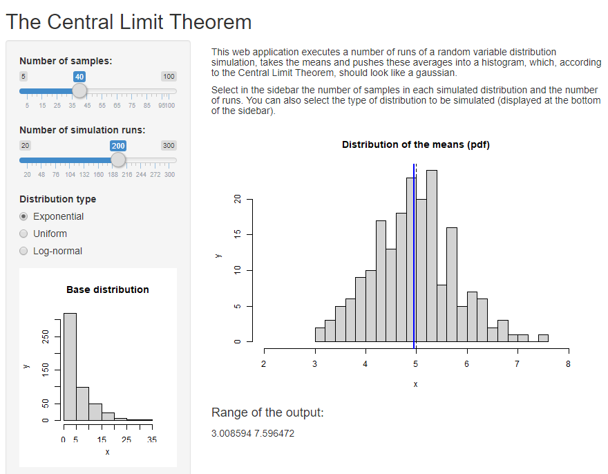

```{r setup, include=FALSE}
knitr::opts_chunk$set(echo = FALSE)
```

## Introduction {.smaller}

This presentation is about a Shiny web application that
executes a number of runs of a random variable distribution simulation,
takes the means and pushes these averages in a histogram of means, which,
according to the Central Limit Theorem, should look like a gaussian.

<div class="columns-2">
```{r echo=FALSE, out.width='110%'}

```


Interface features:

- Slide bar to choose the number of samples in each simulation
- Slide bar for the number of simulations to be conducted.
- Radiobutton to choose the base distribution (exponential, uniform or log-normal).
- A sample distribution is also displayed at the bottom of the sidebar.

</div>
## Implementation details: ui.R {.smaller}

The user interface script sets the different widgets of the application: a title, a sidebar and a main panel.

The following elements are exported so that the server can apply its logic:

- `Samples`: The number of samples in each base distribution
- `Runs`:  The number of samples in each base distribution
- `Distrib`: The kind of base distribution to simulate (exponential, uniform or log-normal)

This is the code used for the slider inputs and radio button:

```{r ui, echo=TRUE, eval=FALSE}

sliderInput("Samples", "Number of samples:", min = 5, max = 100, value = 40),
sliderInput("Runs", "Number of simulation runs:", min = 20, max = 300, 
            value = 200),
radioButtons("Distrib","Distribution type",
             c("Exponential"="exp","Uniform"="unif","Log-normal"="lnorm")),
```

## Implementation details: server.R {.smaller}

In the server script, the distributions are simulated and their means are accumulated into a structure:

```{r server, echo=TRUE, eval=FALSE}

lambda<-0.2
mns<-reactive({ 
    mns=NULL
    n <- input$Samples
    for (i in 1 : input$Runs)
        mns = switch(input$Distrib,
                     exp=c(mns, mean(rexp(n,lambda))),
                     unif=c(mns,mean(runif(n,0,10))),
                     lnorm=c(mns,mean(rlnorm(n,1.11))))
    mns })
```

Later on, the histogram of such structure and the histogram of the base distribution are outputted in variables `distPlot` and `basePlot`. The range of the means distribution is
exported in the `text1` variable.

## Discussion {.smaller}

The main panel displays the outputs from the server like this:

```{r ui2, echo=TRUE, eval=FALSE}
            plotOutput("distPlot"),
            h4("Range of the output:"),
            textOutput("text1")
```

- The smaller the number of samples, the higher the
standard deviation.
- The higher the number of runs, the better a gaussian-like distribution is shaped.

 The theoretical mean of the distribution (red vertical line)
 and the computed mean of the histogram (blue vertical line) are plotted as
 well. These two values must be very close one another.

<div class="centered">
```{r figure, echo=FALSE, out.width='40%'}
    set.seed(50)
    mns=NULL
    for (i in 1 : 200) mns = exp=c(mns, mean(rexp(40,0.2)))
    hist(mns, xlim=c(2,8), breaks=25,xlab="x", ylab="y",
             main="Distribution of the means (pdf)")
        abline(v=5, col="red",lwd=3)
        abline(v=mean(mns),col="blue",lwd=2)

```
</div>
 